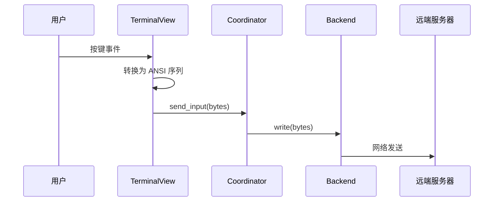
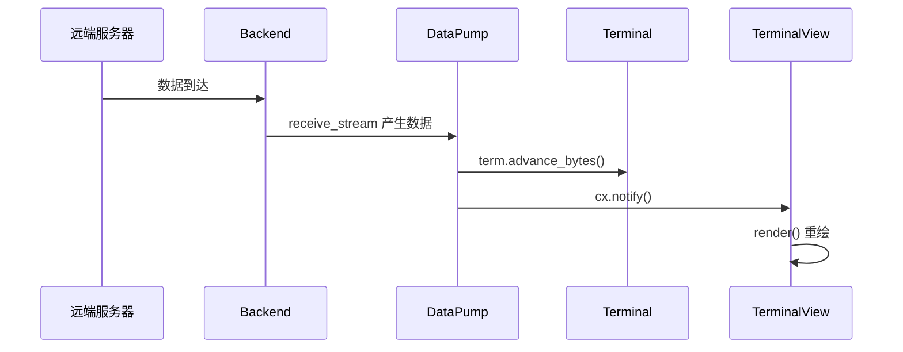

# 数据流与线程模型

> 定义 Zeterm 的数据流转路径与多线程协作机制

---

## 一、数据流概览

```
┌─────────────────────────────────────────────────────────────────────┐
│                          用户交互                                    │
│                     (键盘/鼠标/窗口事件)                             │
└──────────────────────────┬──────────────────────────────────────────┘
                           │
                           ▼
┌─────────────────────────────────────────────────────────────────────┐
│                GPUI主线程                                    │
│┌─────────────┐    ┌─────────────┐    ┌─────────────┐              │
│  │TerminalView │───►│  Coordinator │───►│   渲染      │              │
│  │ (事件处理)  │    │ (状态更新)   │    │  (paint)    │              │
│  └─────────────┘    └──────┬──────┘    └─────────────┘              │
└────────────────────────────┼────────────────────────────────────────┘
                             │
              ┌──────────────┴──────────────┐
              ▼                             ▼
┌─────────────────────────┐   ┌─────────────────────────┐
│      写入通道           │   │      接收通道           │
│  (用户输入 → 远端)│   │  (远端 → 终端解析)      │
└───────────┬─────────────┘   └─────────────┬───────────┘
            │                               │
            ▼                               │
┌─────────────────────────────────────────────────────────────────────┐
│                       Tokio 异步运行时                               │
│         ┌──────────┐    ┌──────────┐    ┌──────────┐                │
│         │ SSH/PTY  │◄──►│ Channel  │◄──►│远端服务 │                │
│         │ Backend  │    │ (russh)  │    │          │                │
│         └──────────┘    └──────────┘    └──────────┘                │
└─────────────────────────────────────┘
```

---

## 二、输入数据流 (用户 → 远端)

### 2.1 时序图



### 2.2 实现要点

1. **按键转换**: `KeyDownEvent` → ANSI 转义序列
2. **异步发送**: 使用 `cx.spawn()` 避免阻塞主线程
3. **错误处理**: 发送失败触发连接状态变更

---

## 三、输出数据流 (远端 → 显示)

### 3.1 时序图



### 3.2 Data Pump 核心逻辑

```
loop {
    select! {
        cancel_token.cancelled() => break,
        data = stream.next() => {
            match data {
                Some(Ok(bytes)) => {
                    terminal.advance_bytes(&bytes)cx.notify()  // 触发重绘
                }
                Some(Err(e)) => handle_error(e),
                None => break,  // 流结束
            }
        }
    }
}
```

---

## 四、线程模型

### 4.1 线程分布

| 线程 | 职责 | 特点 |
|------|------|------|
| GPUI 主线程 | UI 渲染、事件处理 | 必须保持响应 (<16ms) |
| Tokio 工作线程池 | 网络 IO、异步任务 | 多线程并发 |
| 后台任务线程 | 长时间运算| 避免阻塞主线程 |

### 4.2 线程交互

```
┌─────────────────┐         ┌─────────────────┐
│   GPUI 主线程   │◄───────►│  Tokio Runtime  │
│                 │ channel │                 │
│- UI 渲染      │         │  - 网络 IO      │
│  - 事件处理     │         │  - SSH 协议     │
│  - 状态更新     │         │  - 文件传输     │
└─────────────────┘         └─────────────────┘
```

### 4.3 同步机制

| 机制 | 用途 | 示例 |
|------|------|------|
| `Arc<Mutex<T>>` | 共享可变状态 | 终端状态 `Term` |
| `mpsc::channel` | 单向数据流 | 后端数据接收 |
| `watch::channel` | 状态广播 | 连接状态通知 |
| `CancellationToken` | 任务取消 | 优雅关闭 |

---

## 五、背压控制

### 5.1 问题场景

当远端数据产生速度超过终端解析速度时，需要背压控制。

### 5.2 解决方案

-使用**有界 channel** (`mpsc::channel(1024)`)
- 当channel 满时，发送端自动等待
- 配合批量处理减少重绘次数

### 5.3 流量控制参数

| 参数 | 默认值 | 说明 |
|------|--------|------|
| `recv_buffer_size` | 1024 | 接收缓冲区大小 |
| `batch_threshold` | 4096 | 批量处理阈值 |
| `max_batch_delay_ms` | 16 | 最大批量延迟 (~60fps) |

---

## 六、任务生命周期

### 6.1 任务类型

| 任务 | 生命周期 | 取消方式 |
|------|----------|----------|
| Data Pump | 与Session 相同 | Session 关闭时取消 |
| 心跳任务 | 与连接相同 | 断开连接时取消 |
| 文件传输 | 独立 | 用户取消或完成 |

### 6.2 优雅取消

使用 `CancellationToken` 实现协作式取消：

1. 创建 token与任务关联
2. 任务内部 `select!` 监听取消信号
3. 关闭时调用 `token.cancel()`
4. 任务收到信号后清理资源并退出

---

## 七、相关文档

- [五层架构](./layers.md) - 架构分层设计
- [SessionModel](../modules/session-model.md) - 会话模型详情
- [SSH 后端](../modules/ssh-backend.md) - 后端实现细节