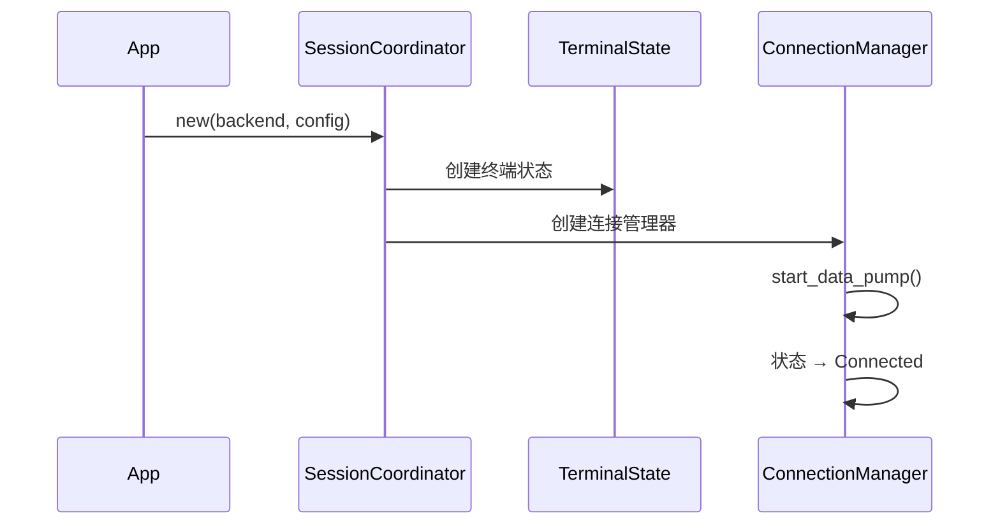

# SessionModel 会话模型

> 连接 UI 层与后端的核心桥梁，管理单个终端会话的完整生命周期

---

## 一、设计目标

| 目标 | 说明 |
|------|------|
| 职责分离 | 终端状态与连接管理解耦 |
| 线程安全 | 支持 GPUI 主线程与 Tokio 异步任务交互 |
| 生命周期管理 | 处理连接建立、数据传输、断开重连 |
| 事件驱动 | 响应用户输入和后端数据 |

---

## 二、组件拆分

### 2.1 架构图

```
┌─────────────────────────────────────────────────────────┐
│                  SessionCoordinator                     │
│                (应用层协调器)                        │
├─────────────────────┬───────────────────────────────────┤
│                     │                                   │
│  ┌─────────────────┐│  ┌─────────────────────────────┐  │
│  │  TerminalState  ││  │    ConnectionManager        │  │
│  │  (终端状态)     ││  │    (连接管理)│  │
│  │ ││  │                             │  │
│  │  - Term (解析)  ││  │  - Backend (连接后端)       │  │
│  │  - Size (尺寸)  ││  │  - StateMachine (状态机)    │  │
│  │  - Scroll (滚动)││  │  - DataPump (数据泵)        │  │
│  └─────────────────┘│  └─────────────────────────────┘  │
└─────────────────────┴───────────────────────────────────┘
```

### 2.2 职责划分

| 组件 | 职责 |
|------|------|
| `SessionCoordinator` | 协调终端状态与连接管理，对外提供统一接口 |
| `TerminalState` | 管理 Alacritty 终端状态机，处理 ANSI 解析 |
| `ConnectionManager` | 管理连接后端、状态机、数据泵任务 |

---

## 三、TerminalState

### 3.1 结构定义

```rust
pub struct TerminalState {
    term: Arc<Mutex<Term<EventProxy>>>,
    size: TerminalSize,
    scroll_offset: u32,
}
```

### 3.2 核心方法

| 方法 | 说明 |
|------|------|
| `advance_bytes(&data)` | 将数据送入终端解析器 |
| `renderable_content()` | 获取可渲染内容 |
| `resize(size)` | 调整终端尺寸 |
| `scroll(delta)` | 滚动视图 |

---

## 四、ConnectionManager

### 4.1 结构定义

```rust
pub struct ConnectionManager {
    backend: Arc<Mutex<Box<dyn TerminalConnection>>>,
    state_machine: ConnectionStateMachine,
    cancel_token: CancellationToken,
}
```

### 4.2 核心方法

| 方法 | 说明 |
|------|------|
| `start_data_pump(cx)` | 启动后台数据接收任务 |
| `send_input(bytes)` | 发送用户输入到远端 |
| `resize(rows, cols)` | 通知远端窗口大小变化 |
| `close()` | 关闭连接，取消所有任务 |

### 4.3 Data Pump 流程

```
loop {
    select! {
        _ = cancel_token.cancelled() => break,
        data = stream.next() => {
            terminal_state.advance_bytes(&data);
            cx.notify();// 触发重绘
        }
    }
}
```

---

## 五、SessionCoordinator

### 5.1 结构定义

```rust
pub struct SessionCoordinator {
    id: SessionId,
    terminal: Model<TerminalState>,
    connection: Model<ConnectionManager>,
    config: SessionConfig,
    host_id: Option<String>,
}
```

### 5.2 对外接口

| 方法 | 说明 |
|------|------|
| `new(backend, config, cx)` | 创建新会话 |
| `send_input(bytes, cx)` | 发送用户输入 |
| `resize(size, cx)` | 调整终端大小 |
| `renderable_content(cx)` | 获取渲染内容 |
| `connection_status(cx)` | 获取连接状态 |
| `close(cx)` | 关闭会话 |

---

## 六、生命周期

### 6.1 创建流程



### 6.2 关闭流程

1. 调用 `cancel_token.cancel()` 取消数据泵
2. 调用 `backend.close()` 关闭连接
3. 更新状态机为`Disconnected`
4. 清理资源

---

## 七、与 View 的交互

```rust
implTerminalView {
    fn render(&mut self, cx: &mut ViewContext<Self>) -> impl IntoElement {
        // 读取会话状态
        let content = self.session.read(cx).renderable_content(cx);
        let status = self.session.read(cx).connection_status(cx);
        // 渲染...
    }
    
    fn handle_key_down(&mut self, event: &KeyDownEvent, cx: &mut ViewContext<Self>) {
        let bytes = self.key_to_ansi(event);
        self.session.update(cx, |session, cx| {
            session.send_input(&bytes, cx);
        });
    }
}
```

---

## 八、配置

| 参数 | 默认值 | 说明 |
|------|--------|------|
| `scrollback_lines` | 10000 | 滚动缓冲区行数 |
| `term_type` | "xterm-256color" | 终端类型 |
| `auto_reconnect` | true | 自动重连 |

---

## 九、相关文档

- [TerminalConnection Trait](../core/connection-trait.md) - 后端接口
- [连接状态机](../core/state-machine.md) - 状态管理
- [数据流设计](../architecture/data-flow.md) - 数据流转
- [TerminalView](./terminal-view.md) - 渲染视图