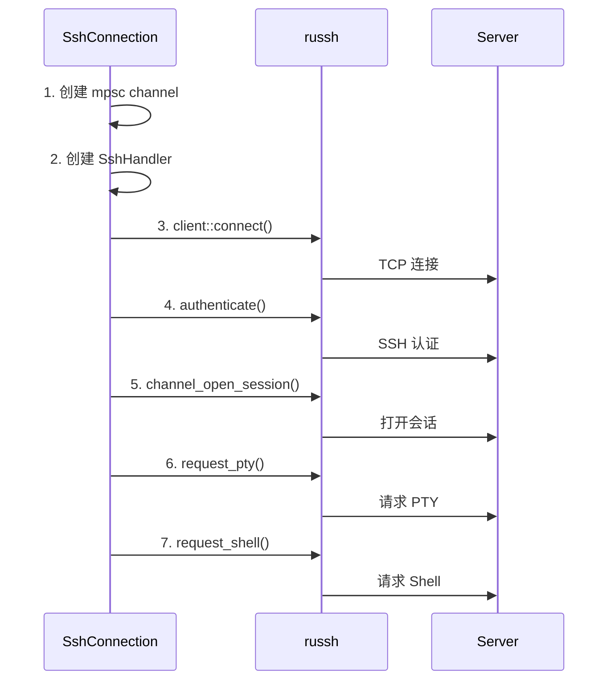

# SSH 后端实现 (russh)

> 基于 russh 实现 `TerminalConnection` Trait

---

## 一、设计目标

| 目标 | 说明 |
|------|------|
| 完整实现 Trait | 提供 SSH 连接能力 |
| 事件驱动转流式| 将 russh 回调模式转换为 `BoxStream` |
| 多种认证 | 密码、公钥、Agent、键盘交互 |
| 会话复用 | 单TCP 连接支持多Channel |

---

## 二、核心架构

```
┌─────────────────────────────────────────────────────────────┐
│                      SshConnection│
│(实现 TerminalConnection Trait)                │
├─────────────────────────────────────────────────────────────┤
│  ┌─────────────┐    ┌─────────────┐    ┌─────────────────┐  │
│  │ SshSession  │    │ SshChannel  │    │ EventConverter│  │
│  │ (russh)     │───►│ (PTY)       │───►│ (回调→Stream)│  │
│  └─────────────┘    └─────────────┘    └────────┬────────┘  │
│                │           │
│                                        BoxStream<Vec<u8>>   │
└─────────────────────────────────────────────────────────────┘
```

---

## 三、核心结构

```rust
pub struct SshConnection {
    session: client::Handle<SshHandler>,  // russh 会话句柄
    channel: Option<ChannelId>,           // PTY 通道
    data_rx: mpsc::Receiver<Vec<u8>>,     // 数据接收通道
    config: SshConfig,                    // 连接配置
    terminal_size: (u16, u16),            // 终端尺寸
}

pub struct SshConfig {
    pub host: String,
    pub port: u16,
    pub username: String,
    pub auth: AuthConfig,
    pub timeout: Duration,
    pub keepalive_interval: Option<Duration>,
}

pub enum AuthConfig {
    Password(String),
    PublicKey { private_key_path: PathBuf, passphrase: Option<String> },
    Agent,
}
```

---

## 四、事件驱动转换方案

### 4.1 问题

russh 使用**回调模式**，但 `TerminalConnection` 需要**流式接口**。

### 4.2 解决方案：Channel Bridge

使用 `mpsc::channel` 作为桥梁：

```
russh Handler (回调)│
        │ data_tx.send(data)
        ▼
   mpsc::channel
        │
        │ ReceiverStream
        ▼
BoxStream<Vec<u8>> (流式)
```

### 4.3 Handler 实现要点

| 回调方法 | 处理逻辑 |
|----------|----------|
| `data()` | 将数据发送到 `mpsc::channel` |
| `eof()` | 关闭发送端，流自然结束 |
| `check_server_key()` | 调用主机密钥验证器 |

---

## 五、TerminalConnection 实现

| 方法 | 实现逻辑 |
|------|----------|
| `write(bytes)` | 调用 `session.data(channel_id, bytes)` |
| `resize(rows, cols)` | 调用 `session.window_change(...)` |
| `receive_stream()` | 将`mpsc::Receiver` 转换为 `BoxStream` |
| `close()` | 发送 EOF，关闭 channel，断开连接 |

---

## 六、连接建立流程



---

## 七、认证方式

| 方式 | 方法 | 说明 |
|------|------|------|
| 密码 | `authenticate_password()` | 最简单，安全性较低 |
| 公钥 | `authenticate_publickey()` | 推荐，需加载私钥 |
| Agent | `authenticate_publickey_with()` | 使用系统 SSH Agent |

### 认证流程

1. 尝试配置的认证方式
2. 成功则继续，失败则返回 `AuthError`
3. Agent 模式会遍历所有可用密钥

---

## 八、连接池设计 (可选优化)

### 8.1 问题

同一主机多个终端会话，每次都建立新 TCP 连接效率低。

### 8.2 方案

```
┌─────────────────────────────────────────┐
│            ConnectionPool               │
├─────────────────────────────────────────┤
│  HashMap<HostKey, PooledConnection>     │
│                │
│  PooledConnection:                      │
│    - session: Handle<SshHandler>        │
│    - channels: Vec<ChannelId>           │
│    - ref_count: usize                   │
└─────────────────────────────────────────┘
```

### 8.3 优势

- 减少 TCP 握手开销
- 减少 SSH 认证开销
- 共享心跳保活

---

## 九、错误处理

| russh 错误 | 转换为 |
|------------|--------|
| `Disconnect` | `ConnectionError::Disconnected` |
| `Timeout` | `ConnectionError::Timeout` |
| `Auth` 相关 | `AuthError::*` |
| 其他 | `ConnectionError::Io` |

---

## 十、相关文档

- [TerminalConnection Trait](../core/connection-trait.md) - 接口定义
- [连接状态机](../core/state-machine.md) - 状态管理
- [错误处理](../core/error-handling.md) - 错误类型